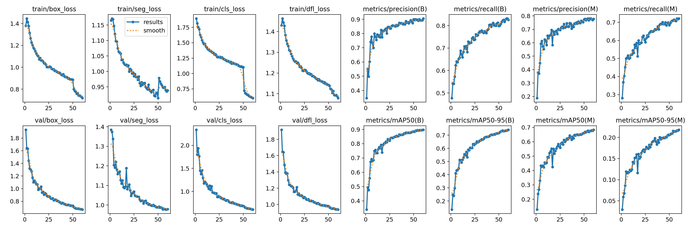
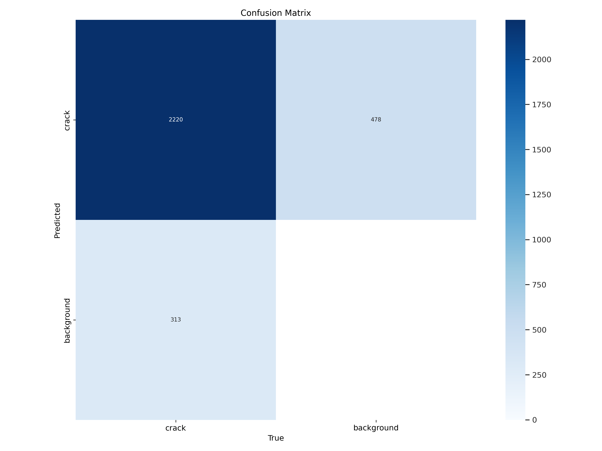
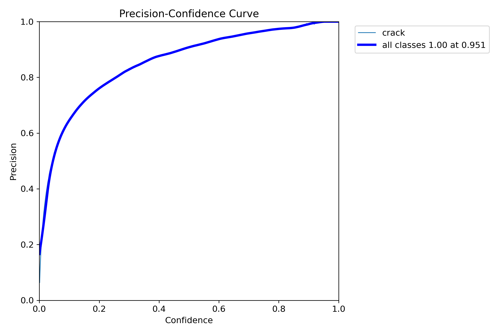
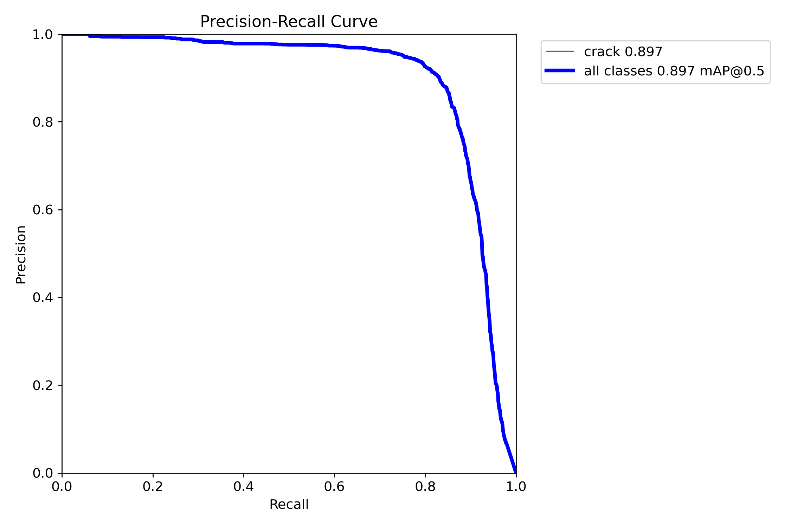
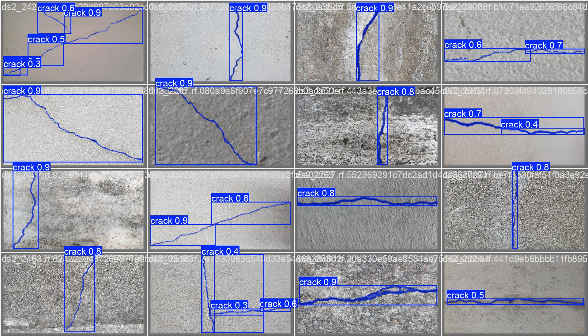

# SmartCrackLens


## Full-Stack Semantic Segmentation for Structural Health Monitoring

<p align="center">
  
  
  
  
  
  
  
</p>

<p align="center">
  
  
  
</p>

<div align="center">
  
</div>

SmartCrackLens is an advanced, end-to-end Computer Vision solution designed to automate the detection, localization, and analysis of surface fractures in structural elements. Built from scratch, the project encompasses the entire MLOps lifecycle—from training a custom YOLOv8 segmentation model to deploying a high-performance full-stack web application.

The core business logic focuses on detecting cracks in surfaces (concrete, metal, asphalt) through real-time instance segmentation, providing actionable structural insights such as crack severity, geometric metrics, and fractal analysis.

---

## Project Structure

```text
.
├── app                     # Backend FastAPI code
│   ├── core                # Global configurations & bootstrap
│   ├── models              # ODM-style Pydantic models for MongoDB
│   ├── routers             # API endpoint definitions
│   ├── schemas             # Pydantic validation schemas
│   ├── services            # Business logic & Inference Engine
│   ├── storage             # Local file storage for images
│   └── utils               # Mathematical & CV utility modules
├── frontend                # Frontend React + Vite code
│   ├── src
│   │   ├── components      # Reusable UI components
│   │   ├── pages           # Main application views (Dashboard, Inference, etc.)
│   │   ├── services        # Axios API clients
│   │   ├── store           # Zustand state management
│   │   └── types           # TypeScript interfaces
├── ml                      # Training artifacts & ONNX models
│   ├── BoxP_curve.png      # Training metrics: Precision
│   ├── BoxPR_curve.png     # Training metrics: Precision-Recall
│   ├── confusion_matrix.png # Model accuracy evaluation
│   ├── results.png         # Overall training losses/metrics
│   ├── val_batch1_pred.jpg # Validation sample predictions
│   └── crack_detection_model.onnx # Fine-tuned inference engine
├── tests                   # Backend & Integration tests
├── docker-compose.yml      # Orchestration for FastAPI & MongoDB
└── requirements.txt        # Python dependencies
```

---

## AI/ML & MLOps Pipeline

### Model Training
The heart of SmartCrackLens is a **fine-tuned YOLOv8-nano segmentation model (YOLOv8n-seg)**, trained on a massive custom dataset of ~13,000 images across diverse surfaces.
- **Training Environment**: Google Colab (NVIDIA Tesla T4 GPU).
- **Training Strategy**: 60 epochs, transfer learning from COCO weights.
- **Optimization**: Post-processing confidence amplification strategy to handle ultra-thin cracks.

### Training Performance Results (Ultralytics)
Below are the key metrics achieved during the fine-tuning process:

<div align="center">

| Metric | Visualization |
| :---: | :---: |
| **Progress Metrics** |  |
| **Confusion Matrix** |  |
| **Precision Curve** |  |
| **P-R Curve** |  |
| **Validation Sample** |  |

</div>

---

## Full-Stack Architecture

### Backend (Python/FastAPI)
A production-grade asynchronous REST API built with **FastAPI** (Python 3.12).
- **Inference Core**: Powered by **ONNX Runtime** for CPU/GPU optimized execution, removing the heavy PyTorch dependency at runtime.
- **Computer Vision**: **OpenCV** & **NumPy** for advanced letterboxing, mask reconstruction, and geometric feature extraction.
- **Fractal Computing**: Implements the **Box-Counting method** to calculate crack fractal dimensions (FD), aiding in complex severity classification.
- **Database**: **MongoDB (NoSQL)** for flexible, document-oriented storage of detection metadata and segmentation polygons.
- **Security**: Stateless **JWT Authentication** + **Bcrypt** password hashing.

###  Frontend (React/TypeScript)
A sleek, modern dashboard designed for real-time analysis and visualization.
- **Stack**: React (Functional Components + Hooks) + TypeScript + Vite.
- **Styling**: Tailwind CSS for a responsive, utility-first design.
- **Data Fetching**: **Axios** with interceptors for authenticated API communication.
- **State Management**: **Zustand** for lightweight, performant global state.
- **Visuals**: **Recharts** for rendering analytical radar charts and timeline trends.

---

##  Evaluation Logic & Intelligence
Cracks are not just detected—they are scientifically analyzed:
- **Severity Matrix**: Automated classification (Low, Medium, High) based on Pixel Area and Max Width.
- **Geometric Metrics**: Extraction of length, width, and orientation (Vertical, Horizontal, Diagonal, Forked).
- **Fractal Dimension (FD)**: FD values (1.0 - 2.0) provide insights into the structural degradation severity.

---

## Getting Started

### Prerequisites
- Docker & Docker Compose
- Node.js (for frontend development)

### Quick Start
1. Clone the repo.
2. Configure `.env` based on `.env.example`.
3. Launch with Docker:
   ```bash
   docker-compose up --build
   4. Access the API at `http://localhost:8001/docs`.
5. Run Frontend:
   cd frontend && npm install && npm run dev
   
---

##  License

<p align="center">MIT License
  
</p>
